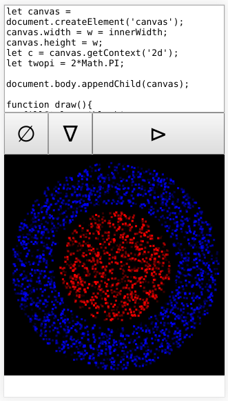

# myConsole

A javascript editor for you phone.

A live version of it is hosted [here](https://victorribeiro.com/myConsole).

You can add it to your phone as an app, if you want to; just click menu / add to your homescreen.

## How to use it

First button clear the page and the cache with the code.

Second button runs the code.

As said above, your code is stored in cache, so you don't loose it.
